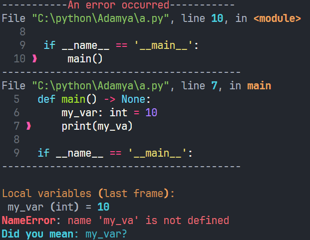
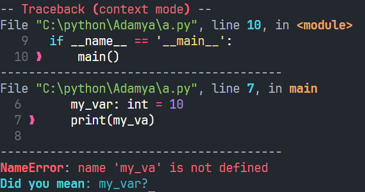
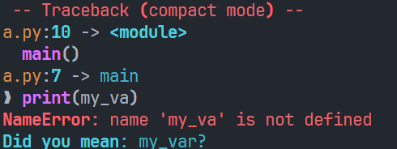
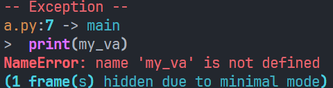

# Better-trace
A Python tool to make tracebacks colorful, context-rich, developer friendly, and turns  
python crashes to something you can easily read
## Features
- A colorful traceback powered by rich
- Multiple modes
    - Verbose - Gives you all the information
    - Context - A balanced view of the traceback (Recommended)
    - Compact - Shows only the last 3 frames, good for quick debugging
    - Minimal - Shows only the last frame, containing the essentials to quickly debug, not for advanced debugging
- Smart suggestions for NameError
- Context view (shows the surrounding lines; only for verbose and context mode)
- ExceptionGroup support
- Thread + Unraisable hooks
- Optional logging to file
- Built-in post mortem debugger (pdb)
## Installation
Install using  
`python3 -m pip install better-trace`
## Quick example
``` python 
from better_trace import initialize

initialize()

# a crash
1 / 0
```
## Configuration
``` python 
initialize(
    show_locals=True,
    log_exceptions=False,
    debugger=False,
    mode="verbose",
    theme="monokai",
    background_color="default",
)
```
| Option | Description |
| ----------|-------------- |
| show_locals  |   Shows locals at crash site (default=True)       | 
| log_exceptions | Logs exceptions to crash.log (default=False) |
| debugger | Enables pdb after exception (default=False)|
| mode | Output style (verbose, context, compact, minimal) (default="verbose") |
| theme | The syntax highlighting theme (default="monokai") |
| background_color | The background color (default="default")|
## Mode preview
### Verbose
full traceback + locals + context  
Shows everything  

### Context
Balanced output with surrounding lines  

### Compact
Short and readable  

### Minimal
Just the last frame and the error line  

## Better-trace demo
``` python
from better_trace import demo

demo()
```
## Reverting back
``` python
from better_trace import revert

revert()
```
## Before and After
### Before
``` text
Traceback (most recent call last):
  File "C:\python\Adamya\a.py", line 10, in <module>
    main()
  File "C:\python\Adamya\a.py", line 7, in main
    print(my_var)
NameError: name 'my_va' is not defined
```
### After

## Notes
- Requires `rich`
- Works best in modern terminals
- Designed for developer experience (not beginner-oriented)
## Credits
### Main developer
**Adamya Mondal** - creator, designer, and maintainer of this project
### Built with
- Python Standard Library
- rich (Huge credits to developers of rich)
### Inspiration
Python's default traceback is really minimal    
So we fixed it to make it more
developer-friendly
### Contributions
- **Adamya Mondal** (for being the main dev)
- Open for contributors
### License
MIT